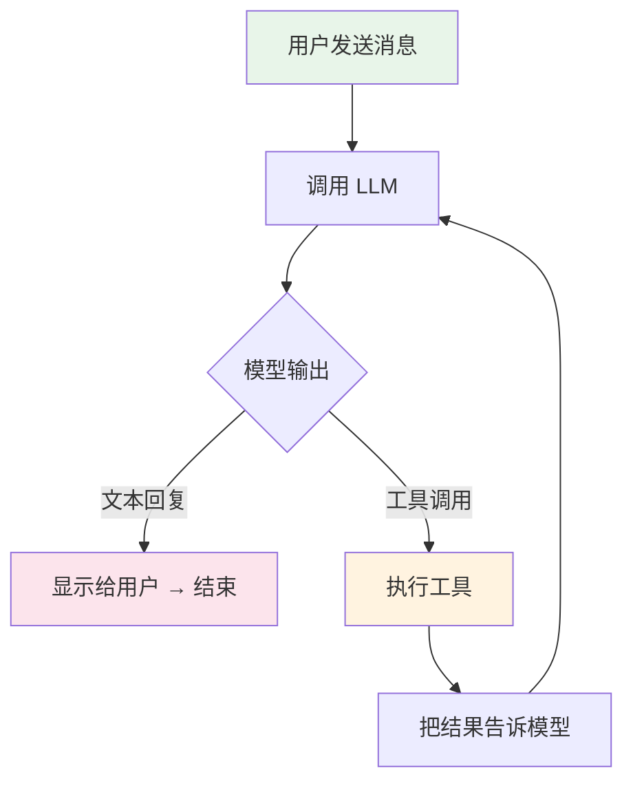

# 第 2 章：Agent 循环——产品自主性的根基

> **段位目标：L2+** | ⏱️ 40 分钟 | 文件：`agent.ts`

## 2.1 Agent ≠ 一次 API 调用

这是最关键的认知转变。

普通 AI 产品是**一问一答**：用户问 → 调 API → 返回结果 → 结束。

Agent 产品是**循环执行**：



**关键：模型在循环里自己决定用什么工具、做几次。你没法预知步数。**

## 2.2 代码怎么实现的

教学版 `agent.ts` 的核心循环（简化版）：

```typescript
// 这是整个 Agent 的心脏——一个 while 循环
while (true) {
  // 1. 调用模型 API（带上全部历史消息）
  const stream = this.anthropicClient.messages.stream({
    model: this.model,
    system: this.systemPrompt,
    tools: toolDefinitions,      // 告诉模型有哪些工具
    messages: this.messages,     // 全部历史消息
  });

  // 2. 处理流式输出
  for await (const event of stream) {
    if (event.type === 'text')     → 打印文字
    if (event.type === 'tool_use') → 记录工具调用
  }

  // 3. 判断是否结束
  if (没有工具调用) break;  // 模型说"我做完了" → 退出循环

  // 4. 有工具调用 → 执行工具 → 把结果加入消息历史
  for (const toolUse of toolUses) {
    const result = await executeTool(toolUse.name, toolUse.input);
    messages.push({ tool_result: result });
  }

  // 5. 检查是否需要压缩上下文
  await this.checkAndCompact();

  // 6. 回到循环顶部 → 再次调 API（带上工具结果）
}
```

> 💡 **PM 理解关键：** 你不需要记住语法。只需要理解——这是一个循环，模型自己决定什么时候停。

## 2.3 产品决策映射

| 你要回答的产品问题 | 对应的技术概念 | 教学版怎么做 | 官方 Claude Code |
|---|---|---|---|
| Agent 最多执行几步？ | `maxTurns` | ❌ 无限制 | ✅ 可配置上限 |
| 花费上限是多少？ | `taskBudget` / `maxBudgetUsd` | ❌ 无限制 | ✅ Token 预算 + 美元预算 |
| 用户等不及了怎么办？ | `AbortController` | ✅ Ctrl+C 中断 | ✅ 优雅中断 + 保存 |
| Agent 卡死了怎么办？ | 超时 + 重试上限 | ✅ 3 次重试 | ✅ 多层超时机制 |
| 一次任务用了几步？ | 工具调用计数 | ❌ 不追踪 | ✅ 完整遥测 |

## 2.4 动手验证

在终端对 Agent 说：

```
👤 你：帮我创建一个 Node.js 项目，包含 package.json、index.js 和 README.md 三个文件
```

**数一下 Agent 执行了几次工具调用。** 通常是 3-6 次（每个文件一次 `write_file`，可能还有 `list_files` 检查）。

> 🎯 **PM 核心认知：** 用户说了 1 句话，Agent 可能执行了 3-10 次工具调用，每次都会消耗 token。你的定价模型如果按「用户消息数」算，会严重低估成本。

## 2.5 产品设计建议

当你设计 Agent 产品时，PRD 里**必须**回答这些问题：

1. **循环边界** — "Agent 最多执行 N 步"。N 是多少？为什么？
2. **预算边界** — "一次任务最多花 $X"。X 是多少？超了怎么办？
3. **时间边界** — "一次任务最多执行 M 分钟"。M 是多少？
4. **中断机制** — "用户随时可以喊停"。喊停后中间结果怎么处理？
5. **重试策略** — "API 报错重试 3 次，间隔指数增长"。还是直接报错？

**所有的「多少」都是产品决策，不是技术默认值。**
