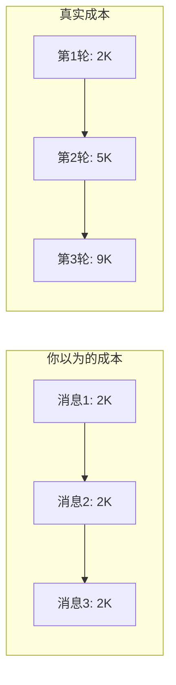

# 第 5 章：上下文与成本——你的定价模型可能是错的

> **段位目标：L3+** | ⏱️ 30 分钟 | 文件：`agent.ts` 的 `checkAndCompact()`

## 5.1 真实成本结构

每次 Agent 调 API，发送的不只是用户的新消息，而是**全部历史消息**：

```
第 1 轮：System Prompt + 消息 1                    → 发 ~2,000 token
第 2 轮：System Prompt + 消息 1 + 回复 1 + 消息 2  → 发 ~5,000 token
第 3 轮：System Prompt + 全部历史 + 消息 3          → 发 ~9,000 token
...
第 N 轮：                                          → 接近上下文上限
```

**这不是线性增长，是三角形面积增长。**



## 5.2 一个具体的计算

假设用户用 Agent 完成一个「创建 3 个文件 + 运行测试」的任务：

| 步骤 | API 调用 | 发送量 | 累计 |
|---|---|---|---|
| 用户发消息 | 第 1 次 | System(2K) + 用户(0.2K) = **2.2K** | 2.2K |
| Agent 用 write_file | 第 2 次 | 上述 + 回复(0.5K) + 工具结果(0.3K) = **3K** | 5.2K |
| Agent 用 write_file | 第 3 次 | 上述 + 回复+结果(0.8K) = **3.8K** | 9K |
| Agent 用 write_file | 第 4 次 | 上述 + 回复+结果(0.8K) = **4.6K** | 13.6K |
| Agent 用 run_shell | 第 5 次 | 上述 + 回复+结果(1K) = **5.6K** | 19.2K |
| Agent 最终回复 | 第 6 次 | 上述 + 回复+结果(0.5K) = **6.1K** | 25.3K |

**用户发了 1 条消息（200 token），实际消耗了 25,300 input token。** 放大了 **126 倍**。

> 🎯 **PM 认知：** 如果你按「每条用户消息 $0.01」定价，真实成本可能是 $0.75。

## 5.3 上下文满了怎么办？

教学版的处理：当 input token 超过上下文窗口的 85% 时，自动触发压缩。

```typescript
private async checkAndCompact(): Promise<void> {
  if (this.lastInputTokenCount > this.effectiveWindow * 0.85) {
    await this.compactConversation();  // 调 API 做摘要
  }
}
```

**压缩过程：**
1. 把全部历史消息发给模型："请总结之前的对话"
2. 模型返回一段摘要
3. 用摘要替换全部历史（~150K → ~3K）
4. 后续对话在摘要的基础上继续

**压缩本身也花钱！** 生成摘要 = 一次额外的 API 调用。

## 5.4 官方版的 5 层压缩

官方 Claude Code 不是只有一种压缩——它有 **5 层递进策略**：

| 层级 | 名称 | 触发条件 | 成本 | 产品类比 |
|---|---|---|---|---|
| 1 | **snip** | 历史太旧 | 零 | 删除浏览器历史 |
| 2 | **microcompact** | 每次查询 | 极低 | 折叠已读邮件 |
| 3 | **contextCollapse** | 上下文较大 | 低 | 收起旧聊天 |
| 4 | **autocompact** | 接近上限 | 中 | 归档旧对话 |
| 5 | **reactiveCompact** | API 报错 | 高 | 紧急清理存储 |

**产品启示：不要只有一种压缩策略。优先用轻量级的，实在不行再用昂贵的——这就是「分级降级」的产品思维。**

## 5.5 成本计算公式

针对你的 Agent 产品，真实成本的估算公式：

```
单次任务成本 = Σ(每轮 input token) × input 价格
             + Σ(每轮 output token) × output 价格
             + 压缩次数 × 压缩成本
```

其中：每轮 input token ≈ system_prompt + Σ(前面所有消息)

> 💡 **简化估算：** 一个 N 轮的 Agent 任务，input token 总消耗约等于 `N × (N+1) / 2 × 平均消息大小`。

## 5.6 产品设计建议

| 决策 | 建议 |
|---|---|
| 定价模型 | 按 token 消耗定价，不按消息数 |
| 成本展示 | 给用户展示实时消耗（教学版的 `/cost`） |
| 压缩策略 | 至少 2 层——轻量优先 + 重度兜底 |
| 上下文上限 | 给用户设合理预期（"长对话可能丢失早期上下文"） |
