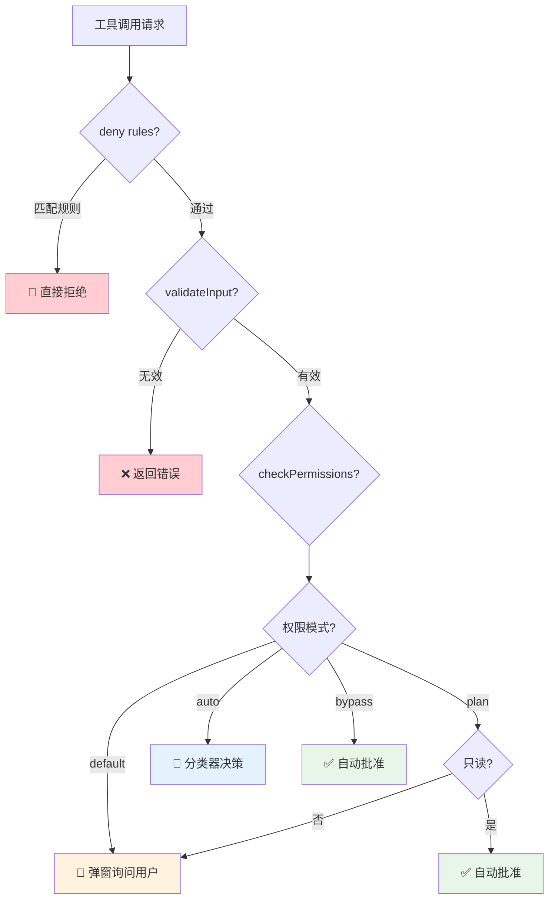

# 第 6 章：安全与信任设计

> **段位目标：L3+** | ⏱️ 30 分钟 | 文件：`tools.ts` 的 `isDangerous()` + `needsConfirmation()`

## 6.1 Agent 安全 ≠ 传统安全

传统产品的安全是「防黑客攻击服务器」。Agent 产品的安全是**防 AI 做错事**。

因为 Agent 会执行**真实操作**——删文件、运行命令、修改代码。一旦模型判断失误，后果是真实的。

## 6.2 信任不是开关，是光谱

教学版的安全设计虽然简单，但思路清晰：

| 操作类型 | 风险等级 | 处理方式 | 理由 |
|---|---|---|---|
| 读文件 | 无 | 自动执行 | 不改变任何状态 |
| 搜索文件/内容 | 无 | 自动执行 | 只读操作 |
| 编辑已有文件 | 中 | 自动执行 | Git 可以回滚 |
| 创建新文件 | 低 | ⚠️ 需确认 | 用户应知道新文件的存在 |
| 执行普通命令 | 低 | 自动执行 | 如 `ls`、`cat`、`npm test` |
| 执行危险命令 | 高 | ⚠️ 需确认 | `rm`、`sudo`、`kill` 等 |

### 危险命令检测

```typescript
const DANGEROUS_PATTERNS = [
  /\brm\s/,           // 删除文件
  /\bgit\s+(push|reset|clean)/, // Git 破坏性操作
  /\bsudo\b/,         // 提权
  /\bmkfs\b/,         // 格式化
  /\bkill\b/,         // 杀进程
  /\breboot\b/,       // 重启系统
  /\bshutdown\b/,     // 关机
];
```

### 确认机制

```typescript
function needsConfirmation(toolName, input) {
  // 危险命令 → 需确认
  if (toolName === "run_shell" && isDangerous(input.command))
    return input.command;
  // 创建新文件 → 需确认
  if (toolName === "write_file" && !existsSync(input.file_path))
    return `write new file: ${input.file_path}`;
  // 其他 → 不需确认
  return null;
}
```

## 6.3 官方版的 4 种权限模式

| 模式 | 只读操作 | 写操作 | 危险操作 | 适合谁 |
|---|---|---|---|---|
| **default** | ✅ 自动 | ❓ 询问 | ❓ 询问 | 新用户 |
| **plan** | ✅ 自动 | ❓ 询问 | ❓ 询问 | 只看不改 |
| **auto** | ✅ 自动 | 🤖 AI 判断 | 🤖 AI 判断 | 高级用户 |
| **bypass** | ✅ 自动 | ✅ 自动 | ✅ 自动 | CI/CD |

### 官方版的 5 层安全



## 6.4 🧪 动手实验：感受安全分级

**实验 1：正常模式**

```bash
npm start
```
```
👤 你：帮我执行 rm -rf node_modules
```
⚠️ 弹出确认——你可以选择 Yes 或 No。

**实验 2：YOLO 模式**

```bash
npm start -- --yolo
```
```
👤 你：帮我执行 rm -rf node_modules
```
⚡ 直接执行，没有确认。

**思考：** 你的 AI 产品里，有几种安全等级可选？

## 6.5 产品设计建议

| 设计决策 | 建议 |
|---|---|
| 安全分几档？ | **至少 3 档**：保守 / 标准 / 信任 |
| 默认哪档？ | 保守——安全的默认值 |
| 升级需要什么？ | 明确的用户确认（不是默默勾选） |
| 有没有底线操作？ | 有——即使在最高信任模式下也需确认的操作 |
| 权限能否记忆？ | 教学版有 `confirmedPaths`——已确认的路径不再重复问 |
| 错误操作能撤销吗？ | 考虑快照 / undo 机制 |
